# A 4WD ROS Robot with autonomous navigation capability

## The Robot Harware Setup 🔧

|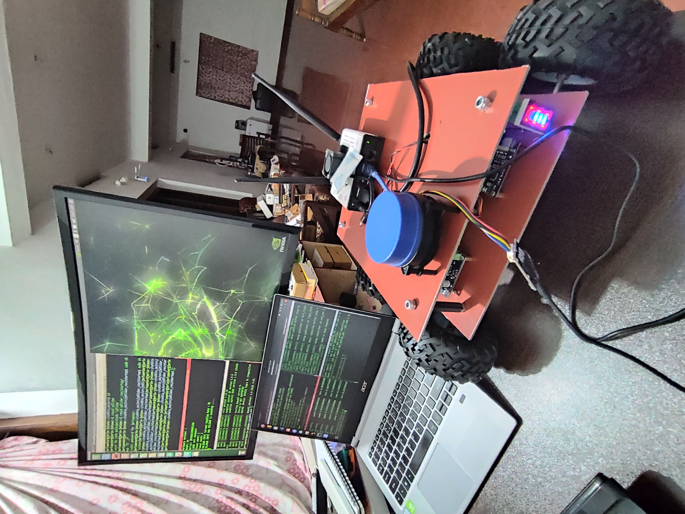|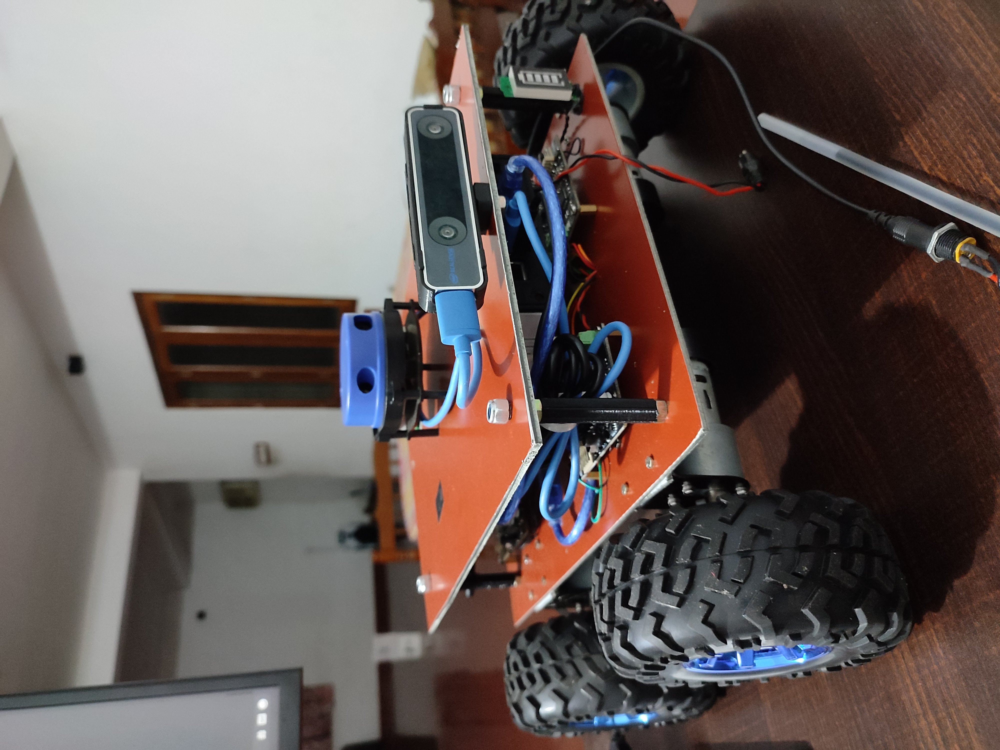|
| :-----: | :-: |
|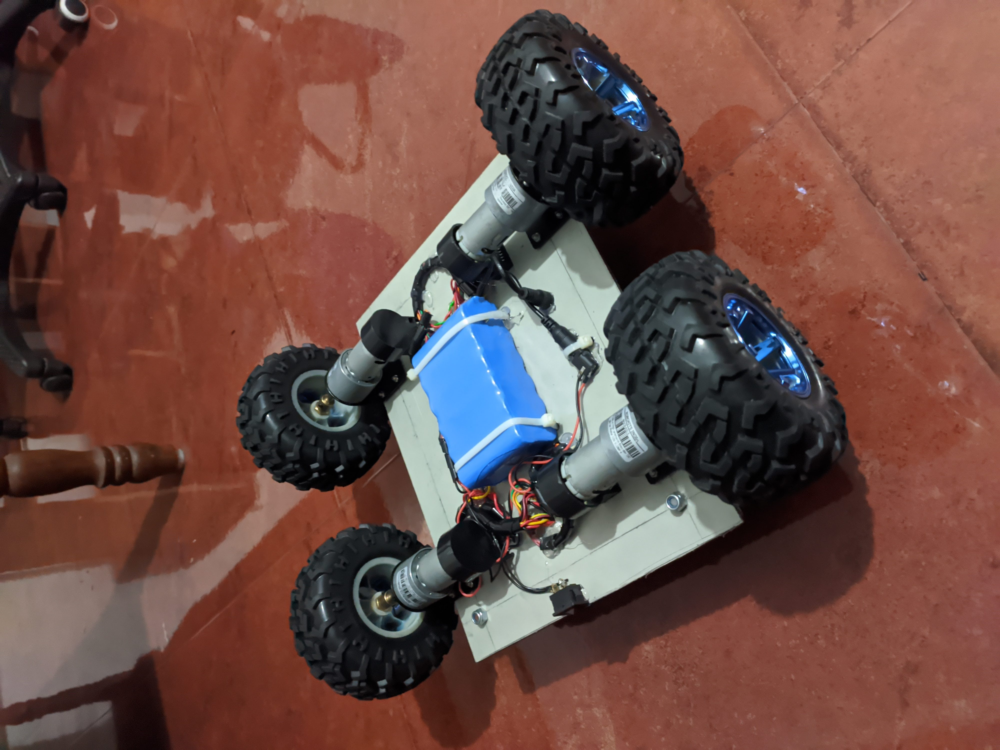 | 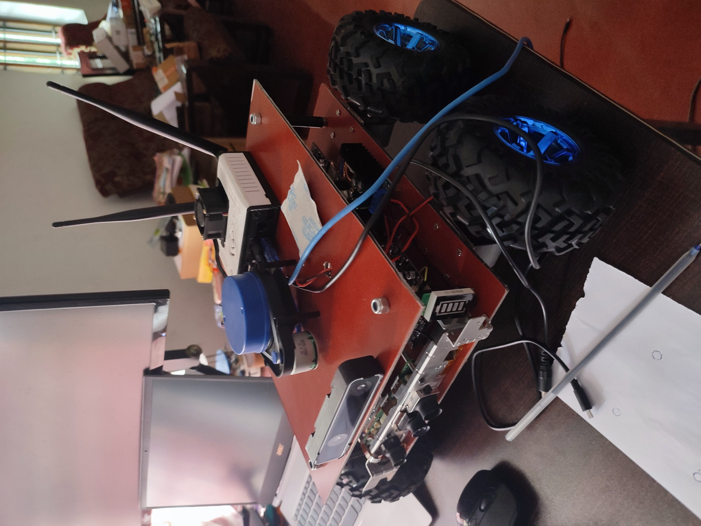 |
|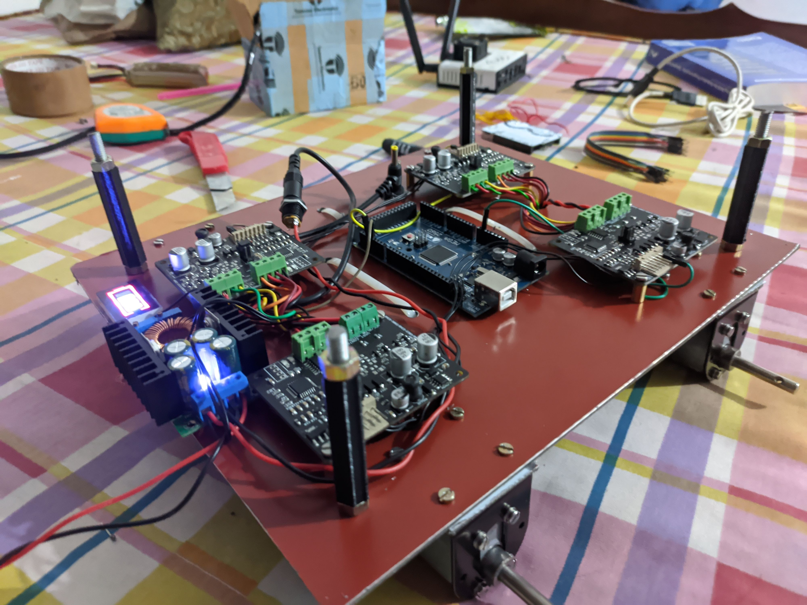| 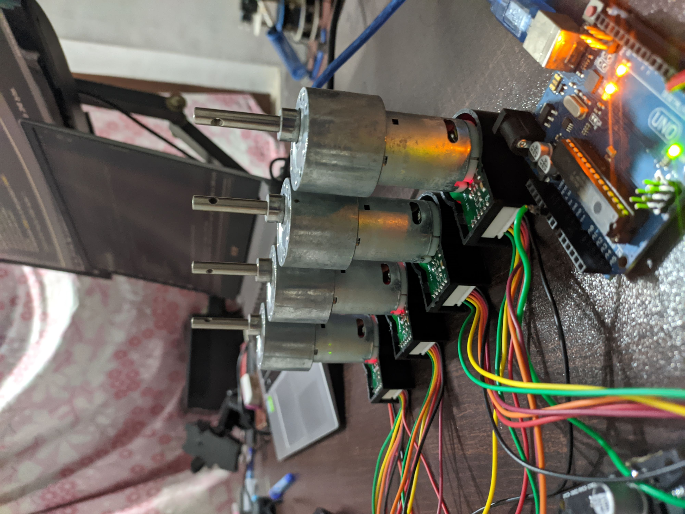

## Installation 💻

```
cd ~/catkin_ws/src

git clone https://github.com/jerinpeter/4wdNavbot.git

cd ..

catkin_make

rosdep install --from-paths src --ignore-src -r -y

```
If catkin_make shows error, install the missing dependenices using the rosdep command.  

## 3D modelling and Simulation 
The Robot was modelled in Fusion360 and converted to URDF using [fusion2urdf](https://github.com/syuntoku14/fusion2urdf).
Gazebo Pluggins for [differential drive](http://gazebosim.org/tutorials?tut=ros_gzplugins#DifferentialDrive),Odometry and [LaserScan](http://gazebosim.org/tutorials?tut=ros_gzplugins#Laser) were added to the urdf and tested in a custom made simulation environment/world in Gazebo.

### Demo video 👇

[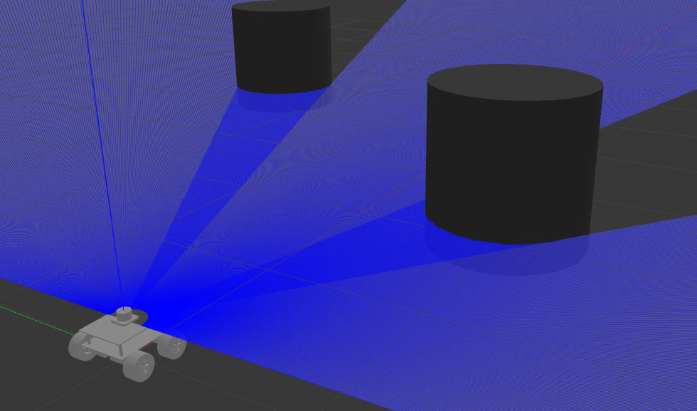](https://www.youtube.com/watch?v=yLzaqpGkmrI)

# Simulation Setup
## Mapping 
Open a new terminal window and split it accordingly if using terminator,run the following commands 
```
roslaunch navbot_description gazebo.launch

roslaunch gmapping mapping.launch

rosrun teleop_twist_keyboard teleop_twist_keyboard.py

rviz

rosrun map_server map_saver -f newmap
```
The map is already saved in /navbot_description/maps directory if using the preset map.

## Navigation
```
roslaunch navbot_description gazebo.launch

roslaunch navbot_navigation move_base.launch

rviz

```
* After opening Rviz open the configuration file from the Rviz folder.
* Type rqt in terminal and open dynamic reconfigure pluggin, load the final_reconf_param_sim.yaml from the reconf_params folder and you are all set to give navigation goals.

# Working in brief
### Note: BOM and references are attached towards the end.

* Starting from the low-level control the Robot uses an **Arduino Mega** takes **cmd_vel** from the Jetson Nano via **ros-serial** via USB. The Arduino is also responsible for reading the encoder values and publishing it back to the Jetson Nano.
### Topics published and subscribed by Arduino
```
/cmd_vel
/right_ticks
/left_ticks 
```
* I have used **RMCS-2303** Motor drivers for controlling the Dc motors with encoders. The motor driver has inbuilt PID control implemented with the help of an STM32 MicroController.
*  The Motor driver is connected to Arduino via **UART** (Tx,RX).4 such motor drivers where used to control the 4 motors and each motors where addresed using a **unique slave-id** set via jumper pins.
* The main advantage of using this motors were that only 3 wires (Tx,Rx,Gnd) was required to control all the 4 motors,vary its speed and read the encoder values.


* The High level control is Nvidia Jetson Nano which runs on [Jetpack](https://developer.nvidia.com/embedded/jetpack) based on ubuntu 18.04 with [ROS Melodic](http://wiki.ros.org/melodic/Installation/Ubuntu) installed.

* The Lidar is also connected to the Jetson Nano via Usb and the whole system is powered using 5v from a buck converter that steps down 12.6v from the Li-Ion Battery pack to 5V 4 amps max to power the Jetson Nano.

## ROS Setup for Mapping and Navigation 

* The arduino publishes the encoder ticks into the Jetson Nano via ros-serial which are subscribed by the [differential_drive](http://wiki.ros.org/differential_drive) package and publishes **/odom** as well as **Tf** **(odom -> base_footprint)**.

The YdLidar package is responsible for publishing the LaserScan as **/scan** data along with **Tf** **(base_link -> laser)**

### **Tf Tree**
* With the Robot Model
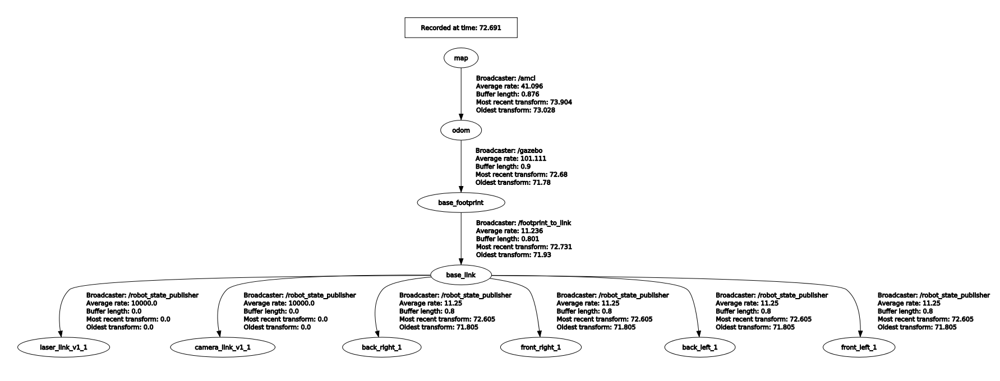

* Without Robot Model

    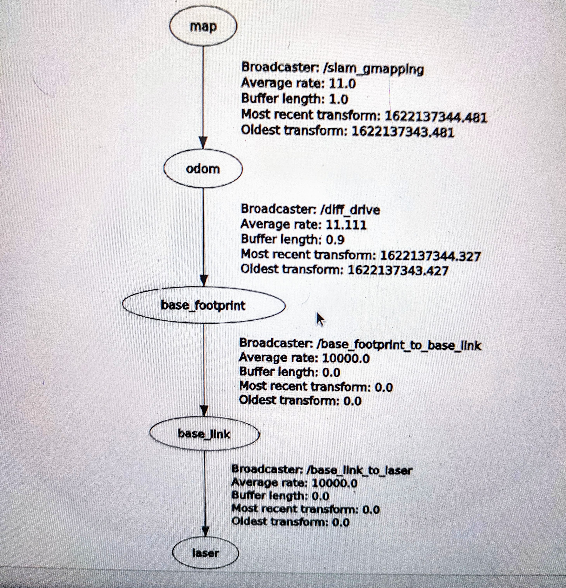

# Real Robot Setup

* Before setting up and running the robot,Jetson Nano and host machine should be set up following this tutorial -> [ROS Network setup](http://wiki.ros.org/ROS/NetworkSetup)

```
roscore

rosrun rosserial_python serial_node.py /dev/ttyACM0

roslaunch ydlidar_ros yd_lidar.launch

roslaunch differential_drive tf_controller.launch

roslaunch navbot_navigation move_base.launch

rviz

```

* After running Rviz open the Navbot.rviz configuration from the Rviz folder.

* Open DynamicReconfigure from rqt gui and load final_reconf_params_real.yaml

* Give the goal location in Rviz and we are good to go!


## Components Used

| Component     | Image           |
| ------------- |:-------------:|
| [Nvidia Jetson Nano](https://www.tannatechbiz.com/nvidia-jetson-nano-developer-kit-b01.html) |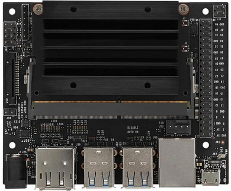| 
| [YD-Lidar X4](https://www.amazon.in/SmartFly-info-LIDAR-053-YDLIDAR-X4/dp/B07DBYHJVQ/ref=sr_1_1?dchild=1&keywords=ydlidar&qid=1625070853&sr=8-1)|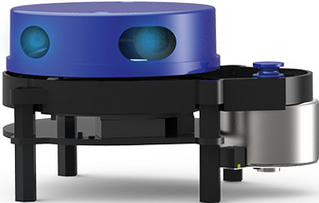| 
|[Arduino Mega](https://robu.in/product/arduino-mega-2560-board-with-compatible-usb-cable/)|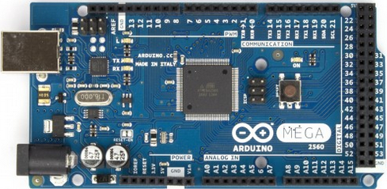| 
| [RMCS 2303 Motor Drivers](https://robokits.co.in/motor-drives-drivers/encoder-dc-servo/rhino-dc-servo-driver-10v-30v-50w-5a-compatible-with-modbus-uart-ascii-for-encoder-dc-servo-motor)|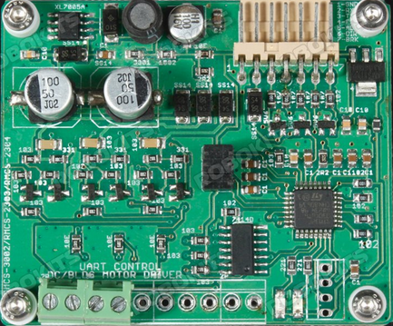
| [100 RPM High Precision Encoder Motors](https://robokits.co.in/motors/encoder-dc-servo/high-torque-high-precision-motor/high-torque-high-precision-encoder-dc-geared-motor-12v-100rpm)|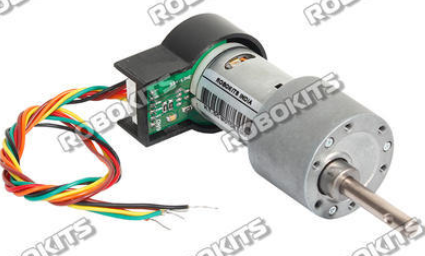
|[10,000Mah, 2C Li-Ion Battery](https://robokits.co.in/batteries-chargers/skycell-li-ion-battery/11.1vli-ion-batteries-9.6-12.6v/li-ion-11.1v-10000mah-2c-with-inbuilt-charger-protection) |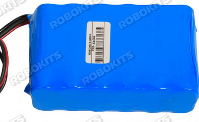
|[DC-DC Step Down Converter](https://robu.in/product/10a-dc-dc-step-down-adjustable-constant-voltage-module/) |
|[125mm AGV Wheels](https://robokits.co.in/robot-wheels/rubber-tracked-wheels/robot-wheel-125mm-diameter-60mm-width-for-atv) | 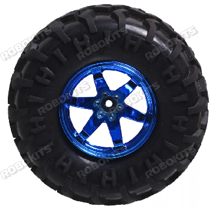

## Further Work

* Modularize all the nodes into launch files for ease of use.
* Addition of the dynamic reconfigure parameters into the navigation param files.
* Using IMU and EKF for better Localization and pose estimate.
* Adding Kinect / realsense for 3D mapping,Vision applications etc.
* Addition of return to base station for charging feature.

## References

[RMCS 2303 Motor Driver Manual](https://robokits.download/downloads/RMCS-2303%20updated%20datasheet.pdf)

[RMCS 2303 Arduino Library](https://robokits.co.in/downloads/RMCS2303drive_V2.zip)

[Motor Specifications](https://robokits.download/downloads/RMCS-5013.pdf)

[ROS Navigation Tuning Guide](https://kaiyuzheng.me/documents/navguide.pdf)

[Map Float Arduino Library](https://github.com/radishlogic/MapFloat)


## [Project Photos and Videos](https://photos.app.goo.gl/16n6vmuHw6YWK7ry7)

* The photos and videos that I took during the build, will make a final video soon!

# UPDATE 12-11-2021 
 
 ## Support for Odom from T265 + TF correction

* Added Support for using Odom from Intel RealSense T265 Tracking Camera
* Added the required TF Launch files for the same
    * To use Odometry from T265 run these extra commands

 ```
roslaunch navbot_navigation tf.launch 

 ```  

 ## UPDATED Base Local Planner -> DWA to TEB

* Updated parameters can be found in the params folder

To install the same use
```
sudo apt-get install ros-noetic-teb-local-planner
```

## Added support for Xbox 360 Kinect for 3D vision -> RTAB mapping, Point Cloud Generation

[Kinect Drivers + ROS Package installation](https://aibegins.net/2020/11/22/give-your-next-robot-3d-vision-kinect-v1-with-ros-noetic/)

* After installtion the following command will open up the depth stream / PointCloud in Rviz

```
roslaunch freenect_launch freenect.launch depth_registration:=true
```

## FINAL WORKING VIDEO [Outdoor Navigation + 3D Point Cloud Generation] 👇


[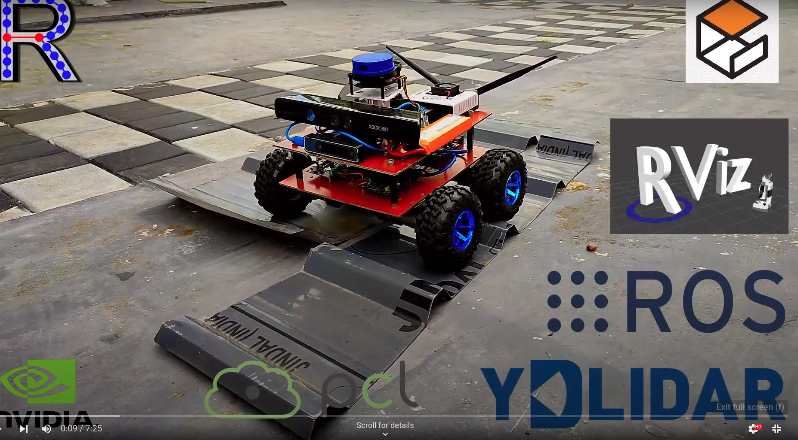](https://youtu.be/Dy9fhVJdwMo)

## Contributions

Contributions are most welcome ;-) 
