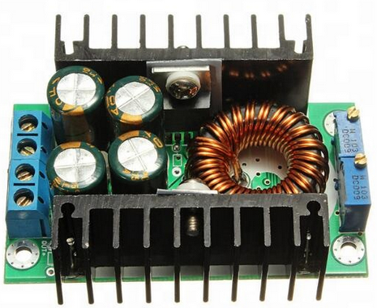

# A 4WD ROS Robot with Autonomous Navigation capability


|||
| :-----: | :-: |
| |  |
|| 

## Installation

```
cd ~/catkin_ws/src

git clone https://github.com/jerinpeter/4wdNavbot.git

cd ..

catkin_make

rosdep install --from-paths src --ignore-src -r -y

```
If catkin_make shows error, install the missing dependenices using the rosdep command.  

## 3D modelling and Simulation 
The Robot was modelled in Fusion360 and converted to URDF using [fusion2urdf](https://github.com/syuntoku14/fusion2urdf).
Gazebo Pluggins for [differential drive](http://gazebosim.org/tutorials?tut=ros_gzplugins#DifferentialDrive),Odometry and [LaserScan](http://gazebosim.org/tutorials?tut=ros_gzplugins#Laser) were added to the urdf and tested in a custom made simulation environment/world in Gazebo.

### Demo

[](https://www.youtube.com/watch?v=yLzaqpGkmrI)


## Components Used

| Component     | Image           |
| ------------- |:-------------:|
| [Nvidia Jetson Nano](https://www.tannatechbiz.com/nvidia-jetson-nano-developer-kit-b01.html) || 
| [YD-Lidar X4](https://www.amazon.in/SmartFly-info-LIDAR-053-YDLIDAR-X4/dp/B07DBYHJVQ/ref=sr_1_1?dchild=1&keywords=ydlidar&qid=1625070853&sr=8-1)|  | 
|[Arduino Mega](https://robu.in/product/arduino-mega-2560-board-with-compatible-usb-cable/)| | 
| [RMCS 2303 Motor Drivers](https://robokits.co.in/motor-drives-drivers/encoder-dc-servo/rhino-dc-servo-driver-10v-30v-50w-5a-compatible-with-modbus-uart-ascii-for-encoder-dc-servo-motor)| 
| [100 RPM High Precision Encoder Motors](https://robokits.co.in/motors/encoder-dc-servo/high-torque-high-precision-motor/high-torque-high-precision-encoder-dc-geared-motor-12v-100rpm)|
|[10,000Mah, 2C Li-Ion Battery](https://robokits.co.in/batteries-chargers/skycell-li-ion-battery/11.1vli-ion-batteries-9.6-12.6v/li-ion-11.1v-10000mah-2c-with-inbuilt-charger-protection) |
|[DC-DC Step Down Converter](https://robu.in/product/10a-dc-dc-step-down-adjustable-constant-voltage-module/) |
|[125mm AGV Wheels](https://robokits.co.in/robot-wheels/rubber-tracked-wheels/robot-wheel-125mm-diameter-60mm-width-for-atv) | 

