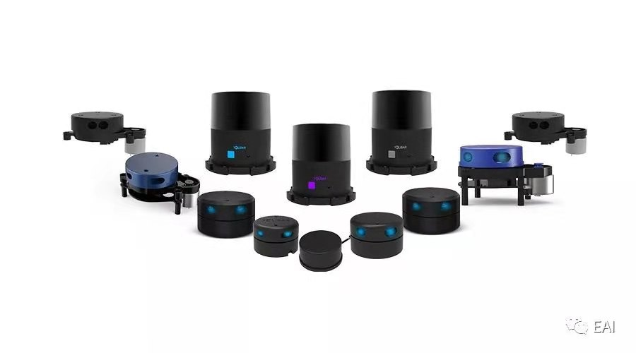
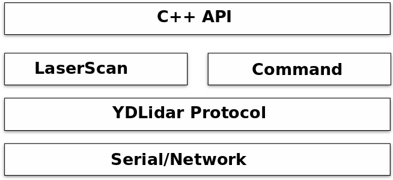
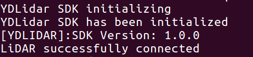
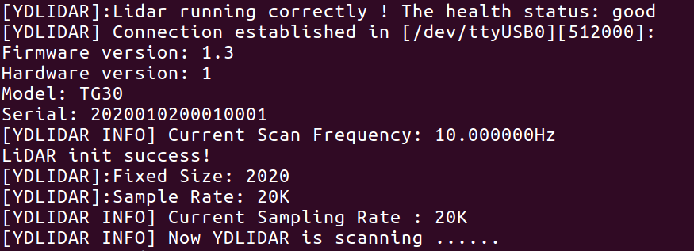
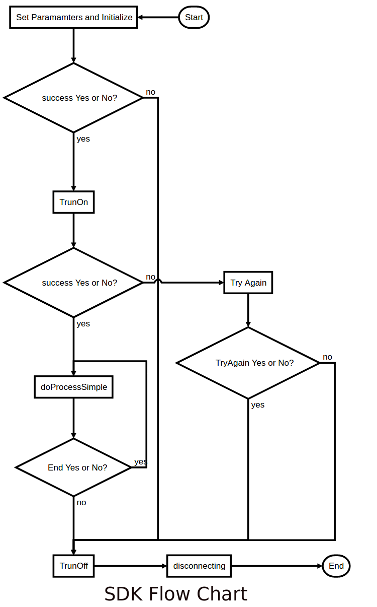
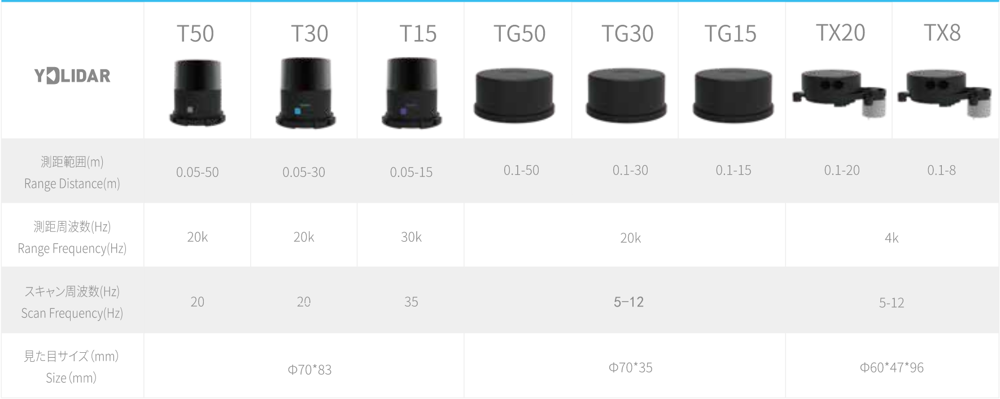

YDLIDAR SDK [](https://travis-ci.org/cansik/sdk) [](https://ci.appveyor.com/project/cansik/sdk) [](https://codebeat.co/projects/github-com-cansik-sdk-samsung)
=====================================================================


# 1 Introduction

YDLIDAR(https://www.ydlidar.com/) series is a set of high-performance and low-cost LIDAR sensors, which is the perfect sensor of 2D SLAM, 3D reconstruction, multi-touch, and safety applications.

If you are using ROS (Robot Operating System), please use our open-source [ROS Driver]( https://github.com/ydlidar/ydlidar_ros) .

## 1.1 Prerequisites
* Linux
* Windows 7/10, Visual Studio 2015/2017
* C++11 compiler

## 1.2 Release Notes
| Title      |  Version |  Data |
| :-------- | --------:|  :--: |
| SDK     |  1.4.7 |   2020-03-31  |

- [feature] support new Lidar G5 and G7.

# 2 YDLidar SDK Communication Protocol
YDLidar SDK communication protocol opens to all users. It is the communication protocol between user programs and YDLIDAR products. The protocol consists of control commands and data format. Please refer to the [YDLidar SDK Communication Protocol](include/ydlidar_protocol.h) for detailed information.

# 3 YDLidar SDK

YDLidar SDK provides the implementation of control commands and Laser scan data transmission, as well as the C/C++ API. The basic structure of YDLidar SDK is shown as below:



 Serial or network is used for communication between YDLidar SDK and LiDAR sensors. Please refer to the YDLidar SDK Communication Protocol for further information. LaserScan supports Laser Scan Data transmission, while Command handler receives and sends control commands. And the C++ API is based on Command and LaserScan Hander.

The YDLidar LiDAR sensors can be connected to host directly by serial or through the YDLidar Adapter board. YDLidar SDK supports both connection methods. When LiDAR units are connected to host directly by Serial, the host will establish communication with each LiDAR unit individually. And if the LiDAR units connect to host through Adapter board, then the host only communicates with the YDLidar Adapter board while the Adapter Board communicates with each LiDAR unit.


# 4 YDLidar SDK API

YDLidar SDK API provides a set of C++ style functions which can be conveniently integrated in C/C++ programs. Please refer to the [YDLidar SDK API Reference](doc/html/index.html) for further information.

## 4.1 Installation
The installation procedures in Ubuntu 18.04/16.04/14.04 LTS and Windows 7/10 are shown here as examples. For Ubuntu 18.04/16.04/14.04 32-bit LTS and Mac, you can get it in [YDLidar-SDK wiki](https://github.com/YDLIDAR/YDLidar-SDK/wiki).
### 4.1.1 Ubuntu 18.04/16.04/14.04 LTS
#### Dependencies
YDLidar SDK requires [CMake 2.8.2+](https://cmake.org/) as dependencies. You can install these packages using apt:
```
sudo apt install cmake pkg-config
```
#### Compile YDLidar SDK
In the YDLidar SDK directory, run the following commands to compile the project:
```
git clone https://github.com/YDLIDAR/sdk.git
cd sdk/build
cmake ..
make
sudo make install
```
### 4.1.2 Windows 7/10
#### Dependencies
YDLidar SDK supports Visual Studio 2015/2017 and requires [CMake 2.8.2+](https://cmake.org/) as dependencies. [vcpkg](https://github.com/Microsoft/vcpkg) is recommended for building the dependency libraries as follows:
For the 32-bit project:
```
.\vcpkg install cmake
.\vcpkg integrate install
```
For the 64-bit project:
```
.\vcpkg install cmake:x64-windows
.\vcpkg integrate install
```
Then, in the YDLidar SDK directory, run the following commands to create the Visual Studio solution file. Please replace [vcpkgroot] with your vcpkg installation path.
Generate the 32-bit project:
```
cd build && \
cmake .. "-DCMAKE_TOOLCHAIN_FILE=[vcpkgroot]\scripts\buildsystems\vcpkg.cmake"
```
Generate the 64-bit project:
```
cd build && \
cmake .. -G "Visual Studio 15 2017 Win64" "-DCMAKE_TOOLCHAIN_FILE=[vcpkgroot]\scripts\buildsystems\vcpkg.cmake"
```
#### Compile YDLidar SDK
You can now compile the YDLidar SDK in Visual Studio.

## 4.2 Run YDLidar SDK Sample
Three samples are provided in samples, which demonstrate how to configure YDLidar LiDAR units and receive the laser scan data when directly connecting YDLidar SDK to LiDAR units or by using a YDLidar Adapter board, respectively. The sequence diagram is shown as below:


### 4.2.1 Ubuntu 18.04/16.04 /14.04 LTS
For Ubuntun 18.04/16.04/14.04 LTS, run the *ydlidar_test* if connect with the Triangle LiDAR unit(s) or TOF LiDAR unit(s):
```
./ydlidar_test
```
### 4.2.2 Windows 7/10
After compiling the YDLidar SDK as shown in section 4.1.2, you can find `ydlidar_test.exe` in the {sdk}\build\Debug or {sdk}\build\Release folder, respectively, which can be run directly.

Then you can see SDK initializing the information as below:



Then you can see SDK Scanning the information as below:



### 4.3 Connect to the specific LiDAR units

Samples we provided will connect all the LiDAR device in you USB in default.There are two ways to connect the specific units:

* run sample with input options in serial port.

* run sample with input options in network.

#### 4.3.1 Program Options

We provide the following program options for connecting the specific units :
```
[Please select the lidar baudrate:]: input LiDAR BaudRate.
[Whether the Lidar is one-way communication[yes/no]:]: Whether The Current LiDAR is single-channel.
[Whether the Lidar is a TOF Lidar [yes/no]:]: Whether The Current LiDAR is TOF Type LiDAR.
[Please enter the lidar scan frequency[5-12]:]:input LiDAR Scan Frequency.
```
Note: Specific LiDAR Input Options, refer to [DataSet](#7-dataset)

Here is the example:
```
__   ______  _     ___ ____    _    ____
\ \ / /  _ \| |   |_ _|  _ \  / \  |  _ \ 
 \ V /| | | | |    | || | | |/ _ \ | |_) | 
  | | | |_| | |___ | || |_| / ___ \|  _ <
  |_| |____/|_____|___|____/_/   \_\_| \_\ 

Baudrate:
0. 115200
1. 128000
2. 153600
3. 230400
4. 512000
Please select the lidar baudrate:4
Whether the Lidar is one-way communication[yes/no]:no
Whether the Lidar is a TOF Lidar [yes/no]:yes
Please enter the lidar scan frequency[5-12]:10
```

# 5 SDK Flow Chart

    

# 6 TOF LiDAR


# 7 Dataset 
|LIDAR      | Model  |  Baudrate |  SampleRate(K) | Range(m)  		   |  Frequency(HZ) | Intenstiy(bit) | SingleChannel | voltage(V)|
| :-------- |:--:|:--:|:--:|:--:|:--:|:--:|:--:|:--:|
| F4        | 1	   |  115200   |   4            |  0.12~12         | 5~12           | false          | false    	  | 4.8~5.2   |
| S4        | 4	   |  115200   |   4            |  0.10~8.0        | 5~12 (PWM)     | false          | false    	  | 4.8~5.2   |
| S4B       | 4/11   |  153600   |   4            |  0.10~8.0        | 5~12(PWM)      | true(8)        | false    	  | 4.8~5.2   |
| S2        | 4/12   |  115200   |   3            |  0.10~8.0     	| 4~8(PWM)       | false          | true    		  | 4.8~5.2   |
| G4        | 5	   |  230400   |   9/8/4        |  0.28/0.26/0.1~16| 5~12        	  | false          | false    	  | 4.8~5.2   |
| X4        | 6	   |  128000   |   5            |  0.12~10     		| 5~12(PWM)      | false          | false    	  | 4.8~5.2   |
| X2/X2L    | 6	   |  115200   |   3            |  0.10~8.0     	| 4~8(PWM)       | false          | true    		  | 4.8~5.2   |
| G4PRO     | 7	   |  230400   |   9/8/4        |  0.28/0.26/0.1~16| 5~12        	  | false          | false    	  | 4.8~5.2   |
| F4PRO     | 8	   |  230400   |   4/6          |  0.12~12         | 5~12        	  | false          | false    	  | 4.8~5.2   |
| R2        | 9	   |  230400   |   5            |  0.12~16     		| 5~12        	  | false          | false    	  | 4.8~5.2   |
| G6        | 13     |  512000   |   18/16/8      |  0.28/0.26/0.1~25| 5~12        	  | false          | false    	  | 4.8~5.2   |
| G2A       | 14	   |  230400   |   5            |  0.12~12         | 5~12      	  | false          | false    	  | 4.8~5.2   |
| G2        | 15		|  230400   |   5            |  0.28~16     		| 5~12      	  | true(8)        | false    	  | 4.8~5.2   |
| G2C       | 16		|  115200   |   4            |  0.1~12        	| 5~12      	  | false      	 | false    	  | 4.8~5.2   |
| G4B       | 17		|  512000   |   10           |  0.12~16         | 5~12        	  | true(10)       | false    	  | 4.8~5.2   |
| G4C       | 18		|  115200   |   4            |  0.1~12		      | 5~12           | false          | false    	  | 4.8~5.2   |
| G1        | 19		|  230400   |   9            |  0.28~16         | 5~12      	  | false          | false    	  | 4.8~5.2   |
| G5        | 20	   |  230400   |   9/8/4        |  0.28/0.26/0.1~16| 5~12        	  | false          | false    	  | 4.8~5.2   |
| G7        | 21     |  512000   |   18/16/8      |  0.28/0.26/0.1~25| 5~12        	  | false          | false    	  | 4.8~5.2   |
| TX8    　 | 100	   |  115200   |   4            |  0.1~8      	   | 4~8(PWM)       | false          | true      	  | 4.8~5.2   |
| TX20    　| 100	   |  115200   |   4            |  0.1~20      	   | 4~8(PWM)       | false          | true     	  | 4.8~5.2   |
| TG15    　| 100	   |  512000   |   20/18/10     |  0.05~15      	| 3~16      	  | false          | false    	  | 4.8~5.2   |
| TG30    　| 101	   |  512000   |   20/18/10     |  0.05~30      	| 3~16      	  | false          | false    	  | 4.8~5.2   |
| TG50    　| 102	   |  512000   |   20/18/10     |  0.05~50      	| 3~16      	  | false          | false    	  | 4.8~5.2   |

   Note: PWM option speed control requires external PWM wave.
   
# 8 Licence

The SDK itself is licensed under BSD [license](license)

# 9 Support

You can get support from YDLidar with the following methods:
* Send email to support@ydlidar.com with a clear description of your problem and your setup
* Github Issues

# 10 Contact EAI


If you have any extra questions, please feel free to [contact us](http://www.ydlidar.cn/cn/contact)
